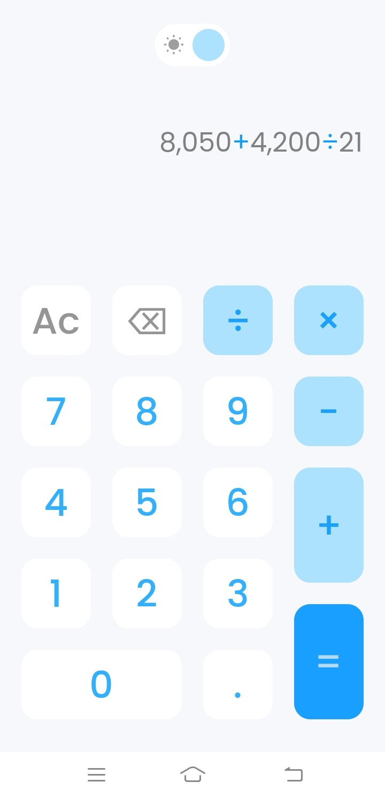
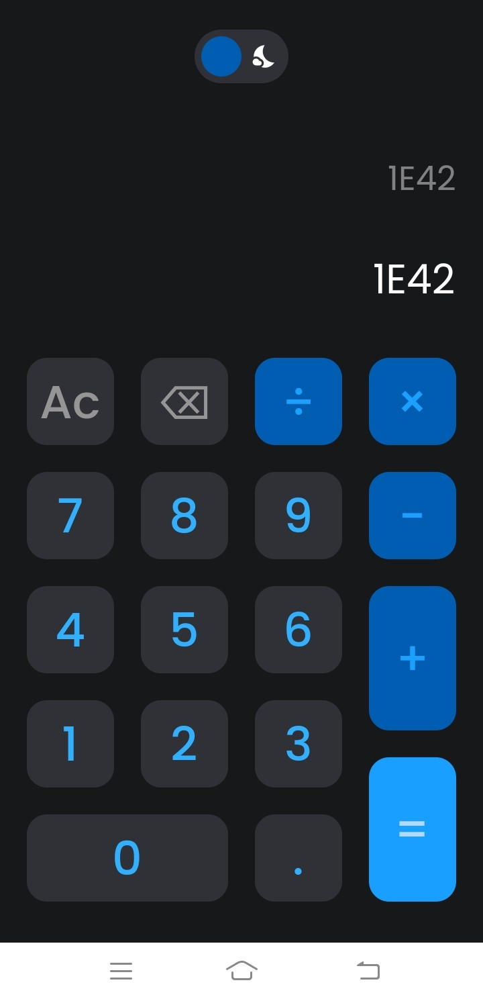

# Flutter Calculator

This is a simple calculator app developed using Flutter.

## Design Credits

This application is designed by drawing inspiration from the design created by [Sadek Hossen Ronny](https://www.figma.com/@sadekui), which can be found on [Figma](https://www.figma.com/community/file/984658356416751911/calculator-app-ui-design-download-free).

Special thanks to [Sadek Hossen Ronny] for providing the amazing design!

## Features

- Basic calculation operations: addition, subtraction, multiplication, division.
- Dynamic display of mathematical expressions.

## App Preview

   

## How to Run

1. Make sure you have Flutter installed. If not, follow the [Flutter installation guide](https://flutter.dev/docs/get-started/install).
2. Clone this repository: `git clone https://github.com/bruhtwig/flutter-calculator.git`
3. Open a terminal and navigate to the project directory: `cd flutter-calculator`
4. Run pub get: `flutter pub get`
5. Run the app: `flutter run`

## Contributions

If you'd like to contribute to this project, feel free to create a pull request. We welcome suggestions and improvements!

## License

This project is licensed under the [MIT License](LICENSE).